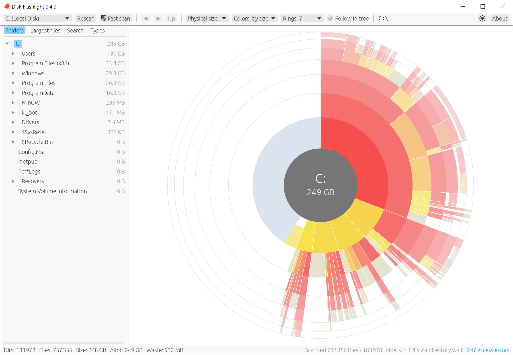

# Disk Flashlight

**English** | [Русский](README.ru.md)

Disk Flashlight is a disk space analyzer for Windows in the spirit of OverDisk. The scanned directory is shown as a sunburst chart: the current directory sits in the centre, each ring outward contains the children of the ring before it, and within every ring the entries are ordered by size, largest first, clockwise from twelve o'clock.



The project is written in Rust and uses [egui](https://github.com/emilk/egui) with the wgpu backend.

## Features

- Scanning of NTFS drives and folders by reading the Master File Table directly when the application runs with administrator rights (the `C:` drive with roughly 920 000 entries is scanned in under one second). A folder is taken out of the table of the whole volume, so even a small folder takes about as long as its drive. The MFT scan counts hard links once, under the folder of the file's first name, and includes system areas such as `System Volume Information` and the NTFS metafiles.
- Parallel directory walk for non-NTFS volumes, network paths and non-elevated runs (the same `C:` drive takes about 8 seconds on a cold cache and about 1.3 seconds on a warm one). When a drive or folder on an NTFS volume is scanned without administrator rights, the **Fast scan** toolbar button (marked with the UAC shield) restarts the application elevated and rescans it through the MFT.
- Sunburst chart with seven rings by default, rendered as a single cached GPU mesh; sectors thinner than one pixel are dropped, so the chart stays responsive regardless of tree size. As in OverDisk, files are drawn with a gap to their folder, so they are told apart from directories at a glance. The number of rings, from 3 to 12, is chosen in the **Rings** list on the toolbar or with the `+` and `-` keys and is kept between runs; the rings thin out towards the rim, so the outermost one is about a quarter as thick as the first whatever their number.
- Items too small to be told apart (under about four points of arc) are merged into one neutral **N smaller items** sector per directory; zooming in splits the group as items become wide enough, and a click on the group zooms in. Edges are smoothed with 4x multisampling.
- When a whole drive (or network share) is scanned and its root is in the centre, the free space is shown as a pale grey-blue sector after the contents in the first ring, with its size and share of the capacity in the tooltip.
- Folders that the directory walk cannot read (usually for lack of rights) are counted in the status bar; the count is a link to the **Access errors** window, which lists their paths with the reason, can copy the list, and opens a folder's location in Explorer from its context menu.
- Tooltip for the sector under the cursor with the name, the logical and allocated size, the share of the parent folder and of the centre of the chart (`12% of Users, 3.4% of C:`), the directory and file counts, and the date of the last change, both as a date and as an age (`2024-03-15 (6 months ago)`). The date of a file is its last write time; the date of a folder is the newest last write time of anything inside it, so that a folder of old files shows as old even when an entry was added to it recently.
- Click on a directory sector to make it the centre, and on a file to move to its folder; a click on the centre goes up; back, forward and up navigation with history.
- Context menu on right-click with **Open in Explorer**, **Properties**, **Copy path** and **Delete…** for the sector under the cursor, or for the current directory when the centre is right-clicked; the same menu is available in the directory tree and in the file lists. **Delete…** asks for confirmation and moves the item to the Recycle Bin (Windows warns before deleting permanently an item that cannot be recycled); the chart, the tree and the lists are then updated without a rescan. The scanned folder itself cannot be deleted. `Ctrl+C` copies the full path of the item under the mouse in the chart or in a list, or of the centre of the chart when the mouse is elsewhere.
- Directory tree on the left, synchronised with the chart in both directions. When the centre of the chart changes, only the folders on the path to it stay expanded. While the mouse moves over the chart, the tree is temporarily expanded to the hovered item and folds back when the mouse rests on the chart outside the sectors (moving the mouse from the chart into the tree keeps it expanded); the **Follow in tree** toolbar option (enabled by default) turns this off.
- **Largest files** tab next to the tree: the 100 largest files under the centre of the chart, with their folders. Hovering a row highlights the file on the chart, and a click moves the chart into the file's folder, where the file stays selected in the list. The list can be limited to files not modified for more than one, two, five or ten years before the scan (**Older than**), which finds large files that have not been used for a long time.
- **Search** tab (`Ctrl+F`): files and folders of the whole scan whose names contain the typed text, ignoring case; the 200 largest matches are listed with the total count and the total size (files inside a matching folder are counted once), and the matching parts of each name are highlighted. Words separated by spaces must all match, in any order; words joined by `;` or `|` are alternatives (`*.mp4;*.mkv`, `mp4|mkv`) and bind tighter than a space; quotes keep a phrase together (`"big fish"`). A word with `*` (any run of characters) or `?` (one character) is a mask for the whole name, as in Explorer: `*.py` finds names ending in `.py`, and `*.mp4;*.mkv 2010` finds MP4 and MKV files with 2010 in the name. The button with a page and a folder cycles between files and folders, files only and folders only. The **ab** button in the field restricts plain-text matches to whole words (so `.py` finds `script.py` but not `module.pyd`) and both are remembered between runs; the **×** button or `Esc` clears the field. While the tab is open, the chart keeps the colour of matches and fades everything else; a folder holding some matches is coloured by the share of its size they take, and its tooltip shows that share. A click on a folder makes it the centre of the chart, a click on a file moves into its folder.
- Both lists can be ordered by size (**Largest first**), by the date of the last change with the oldest first (**Oldest first**) or with the newest first (**Newest first**); when they are ordered by date or filtered by age, a column with the date is shown. The tooltip of a row gives the full path and the date.
- **Types** tab: the file types (extensions, ignoring case) under the centre of the chart with the description Windows gives them, their share of the centre and their total size, largest first; the tooltip of a row adds the number of files and both sizes. A click on a type colours its files on the chart and fades everything else, a second click clears it; a double click lists the files of the type in the **Search** tab (`*.mp4`). The arrow at the left of a type unfolds its 20 largest files under the centre, with their folders; as in the other lists, hovering one outlines it on the chart, a click moves the chart into its folder, and the context menu applies to it. When a type has more files, a link after them opens all of them in the **Search** tab.
- Three colour schemes selectable in the toolbar: **by size**, where the largest item among its siblings is red and smaller ones shift towards yellow, with colours becoming paler towards the rim (as in OverDisk); **by level**, where the colour depends on the ring; and **by age**, where the colour depends on the date of the last change, from red for items changed just before the scan through yellow and green to blue for items ten years old or older, on a logarithmic scale explained by a legend in the corner of the chart. A fourth scheme, **by type**, gives each of the twelve largest file types of the scan a colour of its own and all other files one neutral colour, with folders in grey; the colours do not change while moving through the folders, and a legend in the corner lists them.
- English and Russian interface. The language follows that of Windows (Russian when Windows is shown in Russian, English otherwise) and can be chosen in the **About** window; sizes, dates and numbers follow the language (`4.6 GB` and `2024-03-15` in English, `4,6 ГБ` and `15.03.2024` in Russian). The command-line modes print in English.
- Light and dark themes, switched by the button with a sun, a moon or a half-filled circle next to **About**: a click moves from following the Windows setting (the default) to the light theme, then to the dark one and back. The chart has a palette of its own for each theme; on the dark one the colours are deeper and fade towards the background further out.
- Physical (cluster-rounded, compressed and sparse files taken into account; small files that NTFS keeps inside their MFT record take no space) or logical size as the chart metric.
- Status bar with directory and file counts, logical size, allocated size and slack for the current root.
- Settings are kept between runs: the language, the theme, the chart metric, the colour scheme, the number of rings, the **Follow in tree** option, the tab shown in the left panel, the order of both lists and the age filter of the **Largest files** tab, the window size and position, the tree width, and the last scanned path, which is offered in the path field without being scanned; nothing is selected in the drive list at start-up, so a slow or network drive is not scanned unasked. They are stored in `%APPDATA%\Disk Flashlight\data\app.ron`. A copy becomes portable when a `disk_flashlight.ron` file (an empty one is enough) lies next to `disk_flashlight.exe`: the settings are then kept in that file, and nothing is written to the user profile. If the file cannot be written, for example on a read-only medium, the profile is used instead. The **About** window shows where the settings are kept. If the program stops because of an internal error, it says so in a message box and appends the details to `crash.log` in the same folder.

## Building

Requirements: a stable Rust toolchain (MSVC target) and the Visual Studio Build Tools with the C++ workload.

```
cargo build --release
```

The binary is produced at `target\release\disk_flashlight.exe`.

## Installer and release

The release script builds the executable and a per-user installer (Inno Setup 6 is required):

```
python tools/make_release.py              # tests, release build, installer
python tools/make_release.py --no-tests   # the same without cargo test
```

The installer is written to `dist\Disk_Flashlight_<version>_Setup.exe`, together with a portable archive, `dist\Disk_Flashlight_<version>_portable.zip`, which contains the program and an empty `disk_flashlight.ron` in a `Disk Flashlight` folder, runs without installation and keeps its settings in that file; the version is taken from `Cargo.toml`. Installation does not require administrator rights: the program is placed in `%LOCALAPPDATA%\Programs\Disk Flashlight`. An optional task adds the **Analyze with Disk Flashlight** item to the Explorer context menu of folders and drives; the entry is removed on uninstallation.

Releases on GitHub are built by the **Release** workflow (`.github/workflows/release.yml`). After the version in `Cargo.toml` is updated and committed, pushing a matching tag publishes a release with the installer and the portable archive:

```
git tag v0.1.0
git push origin v0.1.0
```

The workflow stops if the tag does not match the version in `Cargo.toml`. A manual run from the Actions tab builds the same files as a workflow artifact without publishing a release. The executables are not code-signed, so Windows SmartScreen may warn about an unknown publisher on first launch.

## Usage

```
disk_flashlight.exe              # opens the window; a drive is picked from the toolbar
disk_flashlight.exe D:\Projects  # scans the given path on start-up
disk_flashlight.exe --bench C:\  # command-line benchmark of the scanner and layout
disk_flashlight.exe --bench C:\ --walk  # the same benchmark with the MFT scanner disabled
disk_flashlight.exe --version    # prints the version
disk_flashlight.exe --mft C:\    # restarts as administrator (UAC prompt) and scans C: through the MFT
```

Besides the drives, the drive list offers the eight folders scanned most recently (drive roots are not repeated there; **Clear recent** empties the list, which is kept between runs) and **Choose folder…**, which opens the standard Windows folder dialog and scans the chosen folder. A folder or a drive can also be dragged from Explorer onto the window; a dropped file scans the folder it is in. While the application runs as administrator (after **Fast scan**), Windows does not pass drops from the non-elevated Explorer to it. A path can also be typed into the path field at the right of the toolbar, which shows the current path and becomes editable on a click, as the address bar of Explorer: while typing, the matching folders (or drives) are offered below it, the arrow keys pick one, `Tab` or `Enter` takes it, and `Enter` scans the typed path; `Esc` cancels. A path that does not exist or is not a folder is reported in the status bar, and the results on screen stay.

Setting the environment variable `RUST_LOG=disk_flashlight=debug` prints per-phase timings of the MFT scanner.

The `--mft` option requests administrator rights only where they speed up the scan: for a drive or folder on a local NTFS volume, or when no path is given. For another file system or a network path, and when the UAC prompt is declined, the program starts normally and walks the directories.

The version is shown in the window title.

Keyboard shortcuts: `Backspace` goes up, `Alt+Left` and `Alt+Right` move through history, `F5` rescans, `Ctrl+F` opens the search, `Ctrl+C` copies the path of the item under the mouse, `+` and `-` add or remove a ring, `F1` opens the **About** window (also available from the toolbar). A rescan keeps the current folder and the navigation history, and the previous results stay visible until it finishes; if the folder no longer exists, the view moves to its closest remaining parent. When another drive or folder is chosen, the previous results are cleared at once and a spinner with the scan progress is shown instead. The mouse wheel zooms the chart towards the cursor; dragging with the middle mouse button pans it, and a middle-button double click or the small button with the zoom factor in the top right corner of the chart (shown while zoomed or panned) restores the initial view.

## Project layout

| Path | Purpose |
|---|---|
| `src/model.rs` | Arena tree packed in depth-first order with children sorted by size; largest files and name search |
| `src/types.rs` | File types (extensions): totals under a folder and colour slots |
| `src/scan/mft.rs` | NTFS Master File Table reader and parser |
| `src/scan/walk.rs` | Parallel directory walk (rayon over directory listings read in 64 KiB batches) |
| `src/scan/win.rs` | Win32 helpers: drives, directory listing, cluster size, compressed sizes, Recycle Bin, Explorer |
| `src/layout.rs` | Sunburst layout and hit testing |
| `src/render.rs` | Tessellation of sectors into an `egui::Mesh`, palettes for both themes |
| `src/ui/` | Chart widget, directory tree, Largest files, Search and Types tabs, path field, toolbar and status bar, About and Access errors windows |
| `src/history.rs` | Back/forward navigation history |
| `src/settings.rs` | Settings kept between runs, portable mode |
| `src/i18n.rs`, `src/format.rs` | English and Russian interface; sizes, numbers and dates in the interface language |
| `tools/` | Installer script (`setup.iss`) and release script (`make_release.py`) |

## License

MIT, see [LICENSE](LICENSE).
