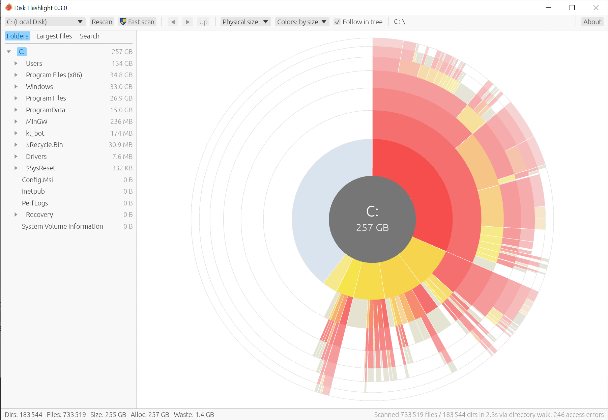

# Disk Flashlight

[English](README.md) | **Русский**

Disk Flashlight — анализатор занятого места на диске для Windows в духе OverDisk. Отсканированный каталог отображается в виде секторной диаграммы (sunburst): текущий каталог находится в центре, каждое следующее кольцо содержит дочерние элементы предыдущего, а внутри кольца элементы упорядочены по размеру: самые крупные идут первыми по часовой стрелке от двенадцати часов.



Проект написан на Rust и использует [egui](https://github.com/emilk/egui) с backend wgpu. Работа продолжается; текущее состояние соответствует MVP, описанному в [PLAN.md](PLAN.md).

## Возможности

- Сканирование целых NTFS-дисков чтением главной файловой таблицы (MFT) напрямую при запуске с правами администратора (диск `C:` примерно с 920 000 объектов сканируется менее чем за секунду). При сканировании через MFT жёсткие ссылки учитываются один раз, а системные области, такие как `System Volume Information` и метафайлы NTFS, включаются в результат.
- Параллельный обход каталогов для подкаталогов, томов без NTFS и запуска без прав администратора (тот же диск `C:` сканируется около 8 секунд на холодном кэше и менее 3 секунд на прогретом). Если целый NTFS-диск сканируется без прав администратора, кнопка **Fast scan** на панели инструментов (отмечена щитом UAC) перезапускает приложение с повышенными правами и повторно сканирует диск через MFT.
- Секторная диаграмма до семи колец, отрисовываемая одним кэшированным GPU-mesh; сектора тоньше одного пикселя не создаются, поэтому отзывчивость не зависит от размера дерева.
- Элементы, слишком мелкие для различения (дуга менее примерно четырёх точек), объединяются в каждом каталоге в один нейтральный сектор **N smaller items**; при увеличении группа распадается по мере того, как элементы становятся достаточно широкими, а щелчок по группе увеличивает диаграмму. Края сглаживаются 4-кратным мультисэмплингом.
- Подсказка с именем, логическим и физическим размером, числом каталогов и файлов для сектора под курсором.
- Щелчок по сектору каталога делает его центром; щелчок по центру поднимает на уровень выше; навигация назад, вперёд и вверх с историей.
- Контекстное меню по правой кнопке мыши с пунктами **Open in Explorer** (открыть в Проводнике) и **Properties** (свойства) для сектора под курсором, а при щелчке по центру — для текущего каталога.
- Дерево каталогов слева, синхронизированное с диаграммой в обе стороны.
- Две цветовые схемы с переключением на панели инструментов: **по размеру** — наибольший элемент среди соседей красный, меньшие смещаются к жёлтому, а к краю диаграммы цвета бледнеют (как в OverDisk), и **по уровню** — цвет зависит от кольца.
- Метрика диаграммы: физический размер (с округлением до кластера, с учётом сжатых и разреженных файлов) или логический.
- Строка состояния с числом каталогов и файлов, логическим и физическим размером и потерями на округление для текущего корня.

## Сборка

Требования: стабильный toolchain Rust (MSVC) и Visual Studio Build Tools с компонентами C++.

```
cargo build --release
```

Исполняемый файл создаётся по пути `target\release\disk_flashlight.exe`.

## Установщик и выпуск

Скрипт выпуска собирает исполняемый файл и установщик для текущего пользователя (требуется Inno Setup 6):

```
python tools/make_release.py              # тесты, release-сборка, установщик
python tools/make_release.py --no-tests   # то же без cargo test
```

Установщик создаётся по пути `dist\Disk_Flashlight_<версия>_Setup.exe` вместе с портативной копией программы `dist\Disk_Flashlight_<версия>_portable.exe`; версия берётся из `Cargo.toml`. Установка не требует прав администратора: программа помещается в `%LOCALAPPDATA%\Programs\Disk Flashlight`. Дополнительная задача установщика добавляет пункт **Анализировать в Disk Flashlight** в контекстное меню Проводника для папок и дисков; при удалении программы пункт удаляется.

Выпуски на GitHub собираются workflow **Release** (`.github/workflows/release.yml`). После изменения версии в `Cargo.toml` и коммита отправка соответствующего тега публикует выпуск с установщиком и портативной версией:

```
git tag v0.1.0
git push origin v0.1.0
```

Если тег не совпадает с версией в `Cargo.toml`, workflow останавливается с ошибкой. Ручной запуск на вкладке Actions собирает те же файлы в виде артефакта без публикации выпуска. Исполняемые файлы не подписаны, поэтому при первом запуске Windows SmartScreen может предупредить о неизвестном издателе.

## Использование

```
disk_flashlight.exe              # открывает окно; диск выбирается в панели инструментов
disk_flashlight.exe D:\Projects  # сканирует указанный путь при запуске
disk_flashlight.exe --bench C:\  # консольный бенчмарк сканера и раскладки
disk_flashlight.exe --bench C:\ --walk  # тот же бенчмарк с отключённым сканером MFT
disk_flashlight.exe --version    # выводит версию
```

При заданной переменной окружения `RUST_LOG=disk_flashlight=debug` выводятся замеры отдельных фаз сканера MFT.

Версия программы отображается в заголовке окна.

Горячие клавиши: `Backspace` — на уровень выше, `Alt+Left` и `Alt+Right` — перемещение по истории, `F5` — повторное сканирование. Колесо мыши увеличивает диаграмму в сторону курсора; перетаскивание средней кнопкой мыши сдвигает её, а двойной щелчок средней кнопкой возвращает исходный вид.

## Структура проекта

| Путь | Назначение |
|---|---|
| `src/model.rs` | Арена-дерево в порядке обхода в глубину, дети отсортированы по размеру |
| `src/scan/mft.rs` | Чтение и разбор главной файловой таблицы NTFS |
| `src/scan/walk.rs` | Параллельный обход каталогов (rayon поверх `read_dir`) |
| `src/scan/win.rs` | Обёртки Win32: список дисков, размер кластера, размер сжатых файлов |
| `src/layout.rs` | Раскладка секторов и определение попадания курсора |
| `src/render.rs` | Тесселяция секторов в `egui::Mesh`, палитра |
| `src/ui/` | Виджет диаграммы, дерево каталогов, панель инструментов и строка состояния |
| `src/history.rs` | История навигации назад и вперёд |
| `tools/` | Сценарий установщика (`setup.iss`) и скрипт выпуска (`make_release.py`) |

## Дальнейшие планы

Планируются: сохранение и загрузка результатов сканирования, контекстное меню для открытия элементов в Проводнике.

## Лицензия

MIT, текст приведён в файле [LICENSE](LICENSE).
